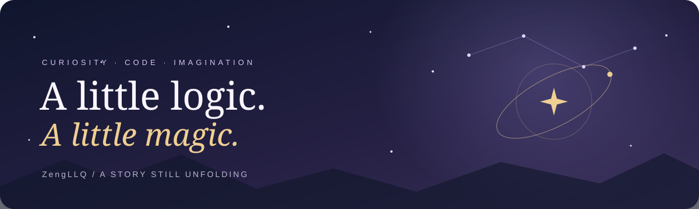

  

**COMPUTER SCIENCE STUDENT · AI & ML EXPLORER · DISNEY KID AT HEART**

*Making room for curiosity, wonder, and whatever comes next.*

[**ABOUT ME**](#-about-me) · [**TECH STACKS**](#-tech-stacks) · [**ACTIVITY**](#-activity)

---

## ✦ ABOUT ME

Once upon a time (well, currently), a **Computer Science student** set off on a quest to make sense of **Artificial Intelligence** and **Machine Learning**. But deep down, I never really stopped being a *Disney kid*, the kind who grew up truly believing magic was real ✨, and that belief never quite faded. I’m utterly enchanted by the beauty of far-off lands, especially *Europe, Australia, and North America* 🌍, exploring their wonder mostly through blogs, vlogs, and movies. And somehow, that same *“anything’s possible”* spirit always finds its way into every project I build, because it turns out even code needs a little **pixie dust** and imagination to truly come to life 🪄

There are *quieter chapters* behind that love of magic. I live with **major depressive disorder**, and there have been times when sleep was difficult, my body felt exhausted, and the things I usually enjoyed seemed far away. I could still look like myself to other people while struggling to answer a message or follow through on a plan. Sometimes, I buried myself in work because staying busy felt easier than explaining why I was pulling away from people I cared about. I had returned to a psychiatrist for help, but *finding the words to tell my friends* was its own difficult step 🌙.

In one of those chapters, **Michelle gave me room to speak**. What began as an ordinary late-night conversation became a chance to share things I had been keeping to myself. She listened, asked questions, and offered a choice I appreciated: *whether I wanted her to respond or simply hear me out*. I could talk without having to turn everything into a clear explanation. And in the days that followed, she kept including me in the ordinary plans I was so often tempted to avoid 🤍.

One of those moments stayed with me. I was about to cancel an outing and had started writing the message. When I opened our conversation, *I remembered her encouragement*. I was still overthinking; leaving the house still felt difficult. For a while, I went back and forth in my head. **Then I deleted the draft and went.** Later, I thanked her, a little awkwardly, because something she had said in a conversation had helped me make a decision that felt much harder than it probably looked 🌱.

There is more to living with depression than I can fit into a few paragraphs, and that evening did not resolve everything I was facing. But I want this part of my story to have a place here, too: a friend who made room for what I was carrying, **a message I never sent, and an evening I almost missed**. *Alongside my love of imagined worlds, I am grateful for moments like that in this one.*

 

> ✧ **A few things that keep me curious** 
> Artificial intelligence & machine learning · Stories that spark imagination · The beauty of far-off places
 

## ✦ TECH STACKS

               

 

## ✦ ACTIVITY

---

  A curious mind. A little pixie dust. A story still unfolding. ✧

